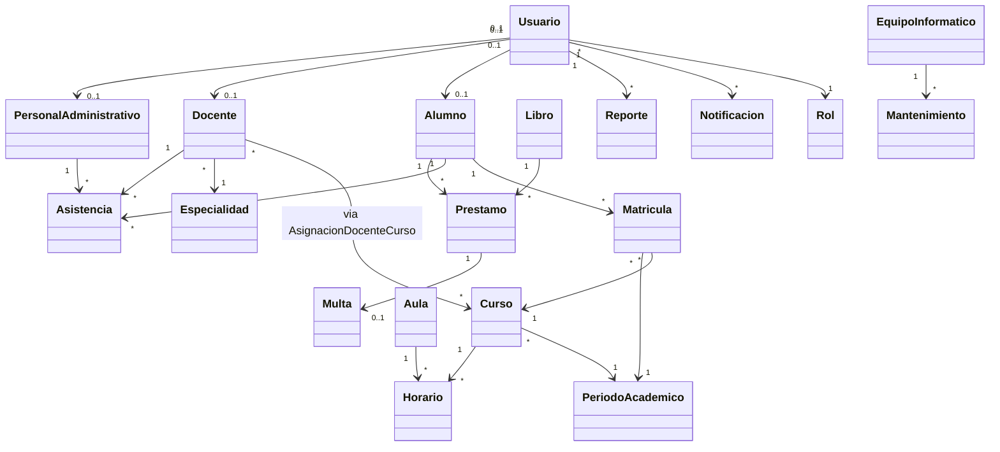

# Relaciones del modelo SIGEA

Este archivo sirve como referencia rápida del modelo de dominio.

```mermaid
classDiagram
  Alumno "1" --> "*" Matricula
  Matricula "*" --> "1" Curso
  Matricula "*" --> "1" PeriodoAcademico
  Curso "*" --> "1" PeriodoAcademico
  Curso "1" --> "*" Horario
  Docente "*" --> "*" Curso : via AsignacionDocenteCurso
  Docente "*" --> "1" Especialidad
  Aula "1" --> "*" Horario
  Alumno "1" --> "*" Asistencia
  Docente "1" --> "*" Asistencia
  PersonalAdministrativo "1" --> "*" Asistencia
  Alumno "1" --> "*" Prestamo
  Libro "1" --> "*" Prestamo
  Prestamo "1" --> "0..1" Multa
  EquipoInformatico "1" --> "*" Mantenimiento
  Usuario "*" --> "1" Rol
  Usuario "1" --> "*" Notificacion
  Usuario "1" --> "*" Reporte
  Usuario "0..1" --> "0..1" Alumno
  Usuario "0..1" --> "0..1" Docente
  Usuario "0..1" --> "0..1" PersonalAdministrativo
```
